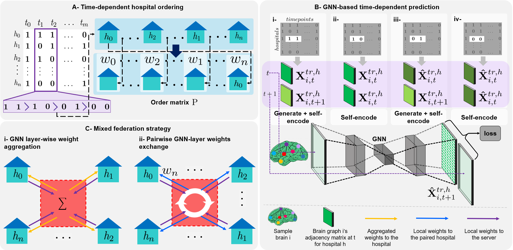
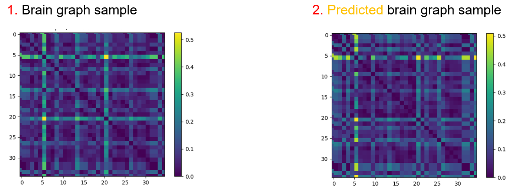

# 4D-FED-GNN++
4D-FED-GNN++, a federated brain graph evolution trajectory prediction framework that learns from brain connectivity data with missing timepoints, coded up in Python
by Zeynep Gürler and Pavel Bozmarov. Please contact zeynepgurler1998@gmail.com or pavel1818@gmail.com for inquiries. Thanks.
 
> **Federated Brain Graph Evolution Prediction using Decentralized Connectivity Datasets with Temporally-varying Acquisitions**

> [Zeynep Gürler](https://github.com/zeynepgurler)<sup>1</sup>, [Islem Rekik](https://basira-lab.com/)<sup>1</sup>
> 
> <sup>1</sup>BASIRA Lab, Faculty of Computer and Informatics, Istanbul Technical University, Istanbul, Turkey
>
> **Abstract:** Foreseeing the evolution of brain connectivity between anatomical regions from a baseline observation can propel early disease diagnosis and clinical decision making. Such task becomes challenging when learning from multiple decentralized datasets with missing timepoints (e.g., datasets collected from different hospitals with a varying sequence of acquisitions).  Federated learning (FL) is an emerging paradigm that enables collaborative learning among multiple clients (i.e., hospitals) in a fully privacy-preserving fashion. However, to the best of our knowledge, there is no FL work that foresees the time-dependent brain connectivity evolution from a single timepoint --let alone learning from non-iid decentralized longitudinal datasets with \emph{varying acquisition timepoints}. In this paper, we propose the first FL framework to significantly boost the predictive performance of local hospitals with missing acquisition timepoints while benefiting from other hospitals with available data at those timepoints without sharing data. Specifically, we introduce 4D-FED-GNN+, a novel longitudinal federated GNN framework that  acts as (i) a graph self-encoder if the next timepoint is locally missing or (ii) a graph generator if the local follow-up data is available. Further, we propose a dual federation strategy, where (i) GNN layer-wise weight aggregation and (ii) pairwise GNN weight exchange between hospitals in a random order. To improve the performance of the poorly-conditioned hospitals (e.g., consecutive missing timepoints, intermediate missing timepoint), we further propose a second variant, namely 4D-FED-GNN++, which federates based on an ordering of the local hospitals computed using their incomplete sequential patterns. Our comprehensive experiments on real longitudinal datasets show that overall 4D-FED-GNN+ and 4D-FED-GNN++ significantly outperform benchmark methods.
 
# Detailed 4D-FED-GNN++ pipeline

An earlier version of this work is published as a MICCAI PRIME workshop paper and available at https://github.com/basiralab/4D-FedGNN

Our framework is a brain graph evolution trajectory prediction framework that learns from decentralized 
datasets with different acquisition timepoints resulting with missing timepoints for some data owners. 
Our Federated learning-based framework comprises two key steps: (1) Time-dependent hospital ordering,
 (2) GNN-based time-dependent prediction, and (3) Mixed federation strategy. Experimental results against comparison methods demonstrate that our
 framework can achieve the best results in terms of Mean Absolute Error (MAE). 
We used the OASIS-2 longitudinal dataset collected by (https://www.oasis-brains.org/) to evaluate our 4D-FED-GNN++.
Further, we also evaluated our proposed framework using a simulated dataset.

More details can be found at: (link to the paper) and our research paper video on the BASIRA Lab YouTube channel (link). 




# Libraries to preinstall in Python
* [Python 3.8](https://www.python.org/)
* [PyTorch 1.7.0](http://pytorch.org/)
* [Torch-geometric](https://github.com/rusty1s/pytorch_geometric)
* [Scikit-learn 0.23.0+](https://scikit-learn.org/stable/)
* [Matplotlib 3.1.3+](https://matplotlib.org/)
* [Numpy 1.20.1+](https://numpy.org/)


**Data preparation**

We provide a demo code to train 4D-FED-GNN++ for brain graph evolution trajectory
 prediction using decentralized datasets with missing timepoints. In demo.py,
 we train 4D-FED-GNN++ on a simulated dataset consisting of 120 subjects with 6 timepoints 
 which are pre-obtained using dataset.py. If you need to generate new simulated data with a 
 different distribution, you can change the mean correlation matrix and connectivity mean
  values in dataset.py. 

If you want to train 4D-FED-GNN++ on the pre-obtained simulated data, 
you can set the model parameters in arg_parse function of 
demo.py and execute,

```bash
python demo.py
```

If you want to train on simulated dataset using 4D-GNN, 4D-FED-GNN+, 4D-FED-GNN++, or Weighted_weight_exchange techniques, 
you can change the mode parameter in arg_parse function of demo.py

demo.py generates the following outputs:



# New experiments
We have worked on upgrading 4D-FED-GNN++. To achieve that we have
worked on two areas of improvement:
* **Custom federated strategy**. We have essentially devised new methods for stronger hospitals to transfer their weights to weaker ones. In addition, we have defined *strength* based not only on the availability of training data but also on the quality of the training samples and the performance of the models.
* **Model Architecture**. We have utilised different GNN and CNN architectures. Although we are working with graph data, CNNs are well-known for capturing patterns in grid-like data structures which is the type of data we are working with (matrices).

Our best GNN model is called TAG++. It uses the same federated strategy as 4D-FED-GNN++ but we have altered the training architecture. It consists of TAGConv layers which allow incorporating information for more distant neighbours in the aggregation step. Our Best CNN-based model is named VGG19++ and utilised the VGG19 architecture and the agin the custom federated setting proposed by 4D-FED-GNN++. The results for all the main new experiments are presented as follows.


Use main.ipynb as your main file to see in detail the architecture and usage of the aforementioned models.

# Please Cite the Following paper when using 4D-FED-GNN++:

@article{gurler2022, <br/>
title={Federated Brain Graph Evolution Prediction using Decentralized Connectivity Datasets with Temporally-varying Acquisitions }, <br/>
author={Gurler Zeynep and Rekik Islem}, <br/>
journal={IEEE Transactions on Medical Imaging},<br/>
volume={}, <br/>
pages={}, <br/>
year={2022}, <br/>
publisher={IEEE} <br/>
}<br/>


